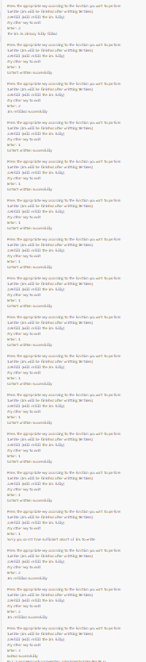
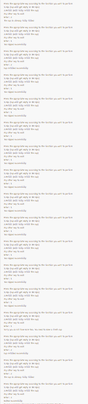
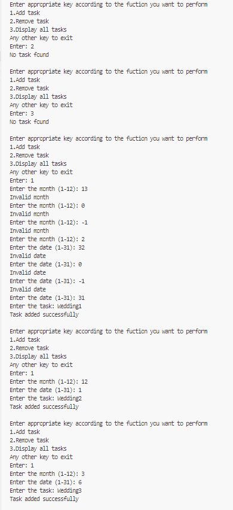
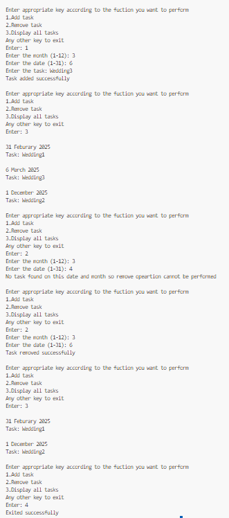
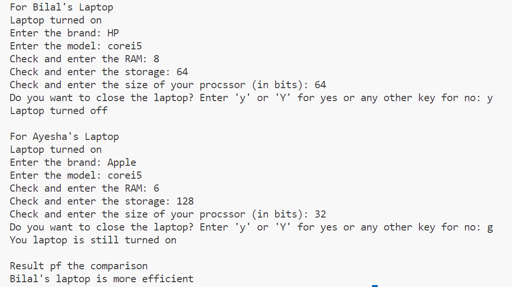
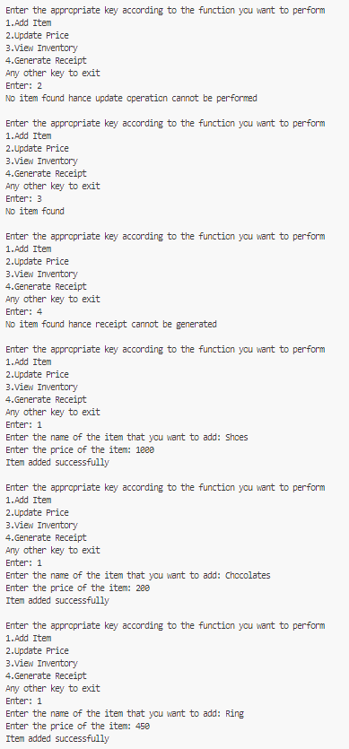
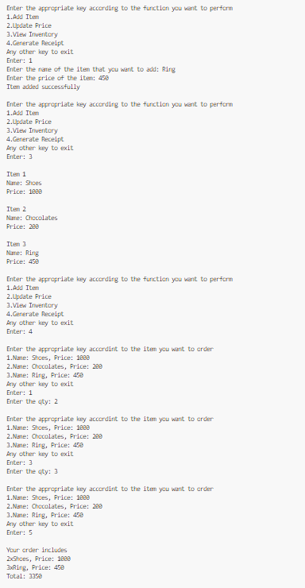
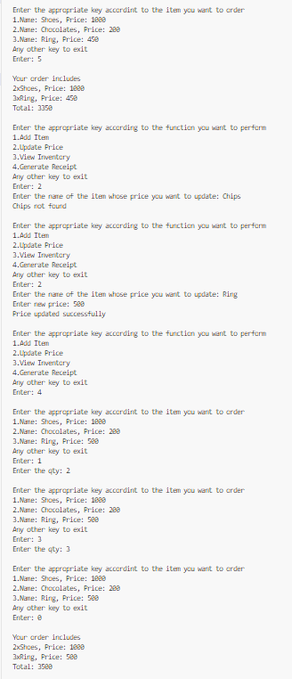
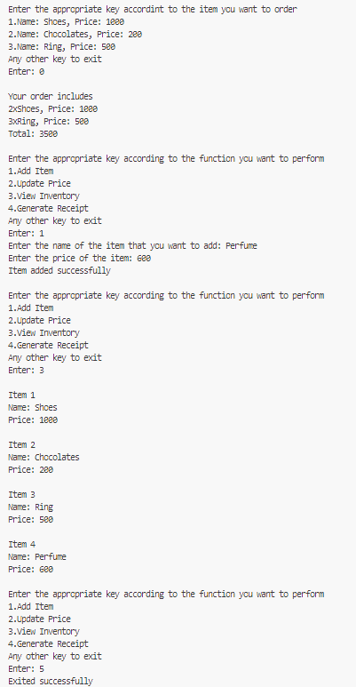

# OOP-LAB-24K-0762

# C++ Code Repository

## Preview
Here are the sample outputs of the programs:

### Task 1 Output:


### Task 2 Output:


### Task 3 Output 1:


### Task 3 Output 2:


### Task 4 Output:


### Task 5 Output 1:


### Task 5 Output 2:


### Task 5 Output 3:


### Task 5 Output 4:



---

## Code
Below are the C++ programs:

### Program 1: 
```cpp
#include<iostream>
using namespace std;
class MarkerPen{
    string brand,color;
    int inkLevel=100,refillability=0;
    public:
        void write(){
            if(inkLevel>0){
                cout<<"Content written successfully"<<endl;
                inkLevel-=10;
                refillability+=10;
            }
            else{
                cout<<"Sorry you do not have sufficient amount of ink to write"<<endl;
            }
        }
        void refill(){
            if(refillability!=0){
                inkLevel+=refillability;
                refillability==0;    
                cout<<"Ink refilled successfully"<<endl;
            }
            else{
                cout<<"The ink is already fully filled"<<endl;    
            }
        }
};
int main(){
    MarkerPen marker1;
    int c;
    do{
        cout<<"Press the appropriate key according to the function you want to perform\n1.Write (Ink will be finished after writting 10 times)\n2.Refill (Will refill the ink fully)\nAny other key to exit\nEnter: ";
        cin>>c;
        switch(c){
            case 1:
                marker1.write();
                break;
            case 2:
                marker1.refill();
                break;
            default:
                cout<<"Exited successfully";
                return 0;
        }
        cout<<endl;
    }while(c==1||c==2);
}


## Code
Below are the C++ programs:

### Program 2: 
```cpp
#include<iostream>
using namespace std;
class TeaMug{
    string brand,color;
    int capacity=0,currentFillLevel=100;
    public:
        void sip_tea(){
            if(currentFillLevel>0){
                cout<<"Tea sipped successfully"<<endl;
                currentFillLevel-=10;
                capacity+=10;
            }
            else{
                cout<<"Sorry you do not have more tea. You need to make a fresh cup"<<endl;
            }
        }
        void refill(){
            if(capacity!=0){
                currentFillLevel+=capacity;
                capacity=0;    
                cout<<"Cup refilled successfully"<<endl;
            }
            else{
                cout<<"The cup is already fully filled"<<endl;    
            }
        }
};
int main(){
    TeaMug mug1;
    int c;
    do{
        cout<<"Press the appropriate key according to the function you want to perform\n1.Sip (Cup will get empty in 10 sips)\n2.Refill (Will fully refill the cup)\nAny other key to exit\nEnter: ";
        cin>>c;
        switch(c){
            case 1:
                mug1.sip_tea();
                break;
            case 2:
                mug1.refill();
                break;
            default:
                cout<<"Exited successfully";
                return 0;
        }
        cout<<endl;
    }while(c==1||c==2);
}


## Code
Below are the C++ programs:

### Program 3: 
```cpp
#include<iostream>
using namespace std;
class Planner{
    string task[12][31];
    public:
        void add_task(int at_first=0){
            if(at_first){
                for(int i=0;i<12;i++){
                    for(int j=0;j<31;j++){
                        task[i][j]="-";
                    }
                }
            }
            else{
                int month,date;
                do{
                    cout<<"Enter the month (1-12): ";
                    cin>>month;
                    if(month<1||month>12){
                        cout<<"Invalid month"<<endl;
                    }
                    else{
                        break;
                    }
                }while(1);
                do{
                    cout<<"Enter the date (1-31): ";
                    cin>>date;
                    if(date<1||date>31){
                        cout<<"Invalid date"<<endl;
                    }
                    else{
                        break;
                    }
                }while(1);
                if(task[month-1][date-1]!="-"){
                    cout<<"Sorry a task is already reserved for this day"<<endl;                    
                }
                else{
                    cout<<"Enter the task: ";
                    cin>>task[month-1][date-1];
                    cout<<"Task added successfully"<<endl;
                }
            }
        }
        void remove_task(){
            int are_all_empty=1;
            for(int i=0;i<12;i++){
                for(int j=0;j<31;j++){
                    if(task[i][j]!="-"){
                        are_all_empty=0;
                        break;
                    }
                }
            }
            if(are_all_empty){
                cout<<"No task found"<<endl;
            }
            else{
                int month,date;
                do{
                    cout<<"Enter the month (1-12): ";
                    cin>>month;
                    if(month<1||month>12){
                        cout<<"Invalid month"<<endl;
                    }
                    else{
                        break;
                    }
                }while(1);
                do{
                    cout<<"Enter the date (1-31): ";
                    cin>>date;
                    if(date<1||date>31){
                        cout<<"Invalid date"<<endl;
                    }
                    else{
                        break;
                    }
                }while(1);
                for(int i=0;i<12;i++){
                    for(int j=0;j<31;j++){
                        if(i==month-1&&j==date-1){
                            if(task[i][j]!="-"){
                                task[i][j]="-";                        task[i][j]="-";
                                cout<<"Task removed successfully"<<endl;
                            }
                            else{
                                cout<<"No task found on this date and month so remove opeartion cannot be performed"<<endl;
                            }
                            break;
                        }
                    }
                }
            }
        }
        void display_task(){
            int are_all_empty=1;
            for(int i=0;i<12;i++){
                for(int j=0;j<31;j++){
                    if(task[i][j]!="-"){
                        are_all_empty=0;
                        cout<<endl<<j+1<<" ";
                        if(i+1==1){
                            cout<<"January ";
                        }
                        else if(i+1==2){
                            cout<<"Feburary ";
                        }
                        else if(i+1==3){
                            cout<<"March ";
                        }
                        else if(i+1==4){
                            cout<<"April ";
                        }
                        else if(i+1==5){
                            cout<<"May ";
                        }
                        else if(i+1==6){
                            cout<<"June ";
                        }
                        else if(i+1==7){
                            cout<<"July ";
                        }
                        else if(i+1==8){
                            cout<<"August ";
                        }
                        else if(i+1==9){
                            cout<<"September ";
                        }
                        else if(i+1==10){
                            cout<<"October ";
                        }
                        else if(i+1==11){
                            cout<<"November ";
                        }
                        else{
                            cout<<"December ";
                        }
                        cout<<"2025"<<endl<<"Task: "<<task[i][j]<<endl;
                    }
                }
            }
            if(are_all_empty){
                cout<<"No task found"<<endl;
            }
        }
};
int main(){
    int c;
    Planner plan;
    plan.add_task(1);
    while(1){
        cout<<"Enter appropriate key according to the fuction you want to perform\n1.Add task\n2.Remove task\n3.Display all tasks\nAny other key to exit\nEnter: ";
        cin>>c;
        switch(c){
            case 1:
                plan.add_task();
                break;
            case 2:
                plan.remove_task();
                break;
            case 3:
                plan.display_task();
                break;
            default:
                cout<<"Exited successfully";
                return 0;
        }
        cout<<endl;
    }
}


## Code
Below are the C++ programs:

### Program 4: 
```cpp

#include<iostream>
using namespace std;
class Laptop{
    int RAM,storage,processor;
    string brand,model;
    public:
        void turn_on_or_off(int turn){
            if(turn){
                cout<<"Laptop turned on"<<endl;
                run_program();
            }
            else{
                cout<<"Laptop turned off"<<endl;
            }
        }
        void run_program(){
            char close;
            cout<<"Enter the brand: ";
            cin>>brand;
            cout<<"Enter the model: ";
            cin>>model;
            cout<<"Check and enter the RAM: ";
            cin>>RAM;
            cout<<"Check and enter the storage: ";
            cin>>storage;
            cout<<"Check and enter the size of your procssor (in bits): ";
            cin>>processor;
            cout<<"Do you want to close the laptop? Enter 'y' or 'Y' for yes or any other key for no: ";
            cin>>close;
            if(close=='y'||close=='Y'){
                turn_on_or_off(0);
            }
            else{
                cout<<"You laptop is still turned on"<<endl;
            }
        }
        void check_specification(Laptop bilal_laptop){
            int bilal_score=0,ayesha_score=0;
            if(bilal_laptop.processor>processor){
                bilal_score++;
            }
            else{
                if(processor>bilal_laptop.processor){
                    ayesha_score++;
                }
            }
            if(bilal_laptop.RAM>RAM){
                bilal_score++;
            }
            else{
                if(RAM>bilal_laptop.RAM){
                    ayesha_score++;
                }
            }
            if(bilal_laptop.storage>storage){
                bilal_score++;
            }
            else{
                if(storage>bilal_laptop.storage){
                    ayesha_score++;
                }
            }
            if(bilal_score>ayesha_score){
                cout<<"Bilal's laptop is more efficient";
            }
            else if(bilal_score<ayesha_score){
                cout<<"Ayesha's laptop is more efficient";
            }
            else{
                cout<<"Both the laptops are equally efficient";
            }
        }
};
int main(){
    Laptop bilal_laptop,ayesha_laptop;
    cout<<"For Bilal's Laptop "<<endl;
    bilal_laptop.turn_on_or_off(1);
    cout<<endl;
    cout<<"For Ayesha's Laptop "<<endl;
    ayesha_laptop.turn_on_or_off(1);
    cout<<endl<<"Result pf the comparison"<<endl;
    ayesha_laptop.check_specification(bilal_laptop);
    return 0;
}


## Code
Below are the C++ programs:

### Program 5: 
```cpp

#include<iostream>
using namespace std;
class GroceryStore{
    int prices[100];
    string items[100];
    public:
        void add_item(string item,int p,int count){
            items[count]=item;
            prices[count]=p;
            cout<<"Item added successfully"<<endl;
        }
        void update_price(int total){
            if(total==0){
                cout<<"No item found hance update operation cannot be performed"<<endl;
            }
            else{
                string item;
                int found=0;
                cout<<"Enter the name of the item whose price you want to update: ";
                cin>>item;
                for(int i=0;i<total;i++){
                    if(items[i]==item){
                        found=1;
                        cout<<"Enter new price: ";
                        cin>>prices[i];
                        cout<<"Price updated successfully"<<endl;
                        break;
                    }
                }
                if(!found){
                    cout<<item<<" not found"<<endl;
                }
            }
        }
        void view_inventory(int total){
            if(total==0){
                cout<<"No item found"<<endl;
            }
            else{
                for(int i=0;i<total;i++){
                    cout<<endl<<"Item "<<i+1<<endl<<"Name: "<<items[i]<<endl<<"Price: "<<prices[i]<<endl;
                }
            }
        }
        void generate_receipt(int total){
            if(total==0){
                cout<<"No item found hance receipt cannot be generated"<<endl;
            }
            else{
                int a,sum=0,qty[100],order[100],p,total_order=0;
                while(1){
                    cout<<"\nEnter the appropriate key accordint to the item you want to order"<<endl;
                    for(int i=0;i<total;i++){
                        cout<<i+1<<".Name: "<<items[i]<<", Price: "<<prices[i]<<endl;                    
                    }
                    cout<<"Any other key to exit"<<endl<<"Enter: ";
                    cin>>a;
                    if(a>0&&a<=total){
                        cout<<"Enter the qty: ";
                        cin>>qty[total_order];
                        p=qty[total_order]*prices[a-1];
                        sum+=p;
                        order[total_order]=a-1;
                        total_order++;
                    }
                    else{
                        break;
                    }
                }
                cout<<endl<<"Your order includes"<<endl;
                for(int i=0;i<total_order;i++){
                    int j=order[i];
                    cout<<qty[i]<<"x"<<items[j]<<", Price: "<<prices[j]<<endl;
                }
                cout<<"Total: "<<sum<<endl;
            }
        }
};
int main(){
    GroceryStore store;
    string item;
    int c,price,total=0;
    while(1){
        cout<<"Enter the appropriate key according to the function you want to perform\n1.Add Item\n2.Update Price\n3.View Inventory\n4.Generate Receipt\nAny other key to exit\nEnter: ";
        cin>>c;
        switch(c){
            case 1:
                cout<<"Enter the name of the item that you want to add: ";
                cin>>item;
                cout<<"Enter the price of the item: ";
                cin>>price;
                store.add_item(item,price,total);
                total++;
                break;
            case 2:
                store.update_price(total);
                break;
            case 3:
                store.view_inventory(total);
                break;
            case 4:
                store.generate_receipt(total);                
                break;
            default:
                cout<<"Exited successfully";
                return 0;
        }
        cout<<endl;
    }
}


